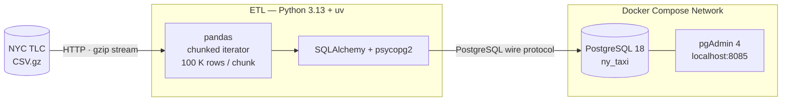

# NYC Taxi Postgres Pipeline

> Batch ETL pipeline that streams NYC TLC Yellow Taxi trip records into PostgreSQL via chunked ingestion - infrastructure fully containerised with Docker Compose.

[](https://www.python.org/)
[](https://www.postgresql.org/)
[](https://docs.astral.sh/uv/)
[](https://docs.docker.com/compose/)
[](LICENSE)

---

## Overview

A chunked batch ingestion pipeline for the NYC TLC Yellow Taxi dataset. Rather than loading the entire compressed CSV into memory, the pipeline uses a pandas iterator to read 100,000 rows per batch, writing each chunk progressively into a PostgreSQL table. The database and admin interface run as isolated Docker Compose services backed by named volumes.

---

## Architecture



---

## Tech Stack

| Layer | Technology | Notes |
|---|---|---|
| Language | Python 3.13 | Pinned via `.python-version` |
| Package manager | uv (Astral) | Lockfile-based reproducible installs |
| Data processing | pandas | Chunked `read_csv` iterator |
| DB interface | SQLAlchemy + psycopg2 | ORM-independent engine usage |
| Database | PostgreSQL 18 | Named volume for data persistence |
| Admin UI | pgAdmin 4 | Browser-based query and exploration |
| Infrastructure | Docker Compose | Single-command environment bootstrap |

---

## Project Structure

```
nyc-taxi-postgres-pipeline/
├── ingest_data.py       # Core ETL: chunked CSV read → PostgreSQL write
├── Dockerfile           # Python 3.13-slim image; uv binary from official image
├── docker-compose.yaml  # PostgreSQL 18 + pgAdmin 4 with named volume mounts
├── pyproject.toml       # Project metadata and dependencies
├── uv.lock              # Pinned lockfile — reproducible across environments
├── .python-version      # Python version pin consumed by uv
└── README.md
```

---

## Prerequisites

- [Docker Desktop](https://www.docker.com/products/docker-desktop/) (or Docker Engine + Compose plugin)

---

## Quick Start

### 1. Clone

```bash
git clone https://github.com/<your-username>/nyc-taxi-postgres-pipeline.git
cd nyc-taxi-postgres-pipeline
```

### 2. Start the infrastructure

```bash
docker compose up -d
```

| Service | URL / Port | Credentials |
|---|---|---|
| PostgreSQL | `localhost:5432` | `root` / `root` |
| pgAdmin | http://localhost:8085 | `admin@admin.com` / `root` |

### 3. Run the ingestion

**Option A — Locally (requires [uv](https://docs.astral.sh/uv/getting-started/installation/))**

```bash
uv run python ingest_data.py
```

**Option B — Inside Docker**

```bash
docker build -t taxi-ingest .

docker run --rm \
  --network <project-directory>_default \
  -e PGHOST=pgdatabase \
  taxi-ingest
```

> `PGHOST` defaults to `localhost`. When running inside Docker, set it to `pgdatabase` (the Compose service name) so the container resolves the database host over the Compose network.

### 4. Explore in pgAdmin

1. Open http://localhost:8085
2. **Register a new server:**
   - **Host:** `pgdatabase`
   - **Port:** `5432`
   - **Database:** `ny_taxi`
   - **Username / Password:** `root` / `root`
3. Navigate to `ny_taxi → Schemas → public → Tables → yellow_taxi_data`

---

## Configuration

| Parameter | Default | Description |
|---|---|---|
| `PGHOST` | `localhost` | PostgreSQL hostname |
| `pg_port` | `5432` | PostgreSQL port |
| `pg_db` | `ny_taxi` | Target database name |
| `year` / `month` | `2021` / `1` | Source dataset period (Jan 2021) |
| `chunksize` | `100_000` | Rows processed per write batch |

---

## Data Schema

Explicit `dtype` declarations are applied at read time to prevent pandas from silently coercing nullable integers to `float64` when `NaN` values are present.

| Column | Type | Notes |
|---|---|---|
| `tpep_pickup_datetime` | `datetime64` | Parsed via `parse_dates` |
| `tpep_dropoff_datetime` | `datetime64` | Parsed via `parse_dates` |
| `VendorID` | `Int64` | Nullable integer |
| `passenger_count` | `Int64` | Nullable integer |
| `trip_distance` | `float64` | |
| `RatecodeID` | `Int64` | Nullable integer |
| `store_and_fwd_flag` | `string` | `Y` / `N` flag |
| `PULocationID` | `Int64` | TLC pickup zone ID |
| `DOLocationID` | `Int64` | TLC dropoff zone ID |
| `payment_type` | `Int64` | 1 = Credit card, 2 = Cash, etc. |
| `fare_amount` | `float64` | |
| `tip_amount` | `float64` | |
| `tolls_amount` | `float64` | |
| `total_amount` | `float64` | |
| `congestion_surcharge` | `float64` | |

---

## Design Decisions

**Chunked ingestion over bulk load**
Reading in 100K-row batches keeps memory usage constant regardless of file size. The same code path works whether the source file is 128 MB or several GB - no memory limit tuning or file splitting needed.

**Schema initialisation via `head(n=0)`**
On the first iteration, `df.head(n=0).to_sql(if_exists='replace')` creates the table schema without inserting any rows; all subsequent chunks use `if_exists='append'`. This separates DDL from DML and prevents accidental schema resets mid-run.

**Explicit `dtype` mapping**
Auto-inference on a CSV of this shape produces incorrect types for nullable integer columns containing `NaN` - pandas promotes them to `float64`. Declaring column types upfront makes schema intent explicit and surfaces upstream format changes at read time rather than silently downstream.

**uv for dependency management**
The Dockerfile copies the uv binary directly from the official Astral image rather than installing via pip, eliminating a bootstrap step and keeping the image layer lean. `uv sync --locked` ensures the lockfile is honoured in every build.

---

## Potential Improvements

| Area | Description |
|---|---|
| **CLI parameterisation** | Accept `--year`, `--month`, `--chunksize` via `argparse` or `typer` to avoid code edits between runs |
| **Secrets management** | Move credentials to `.env` + Compose `env_file` |
| **Idempotency** | Add a surrogate key or `ON CONFLICT DO NOTHING` so pipeline re-runs are safe without manual table drops |
| **Post-load indexing** | Create indexes on `tpep_pickup_datetime`, `PULocationID`, and `DOLocationID` after the initial load |
| **Structured logging** | Emit per-chunk metrics - elapsed time, rows written, cumulative count |
| **Multi-period ingestion** | Loop over a configurable date range to backfill multiple months |
| **Orchestration** | Wrap as an Airflow DAG or Prefect flow for scheduled, retriable execution |
| **Testing** | Add pytest integration tests against a containerised test database via Testcontainers |
| **CI/CD** | GitHub Actions workflow to lint, type-check, and run integration tests on PR |

---

## License

[MIT](LICENSE)

---

*Source data: [NYC TLC Trip Record Data](https://www.nyc.gov/site/tlc/about/tlc-trip-record-data.page)*
